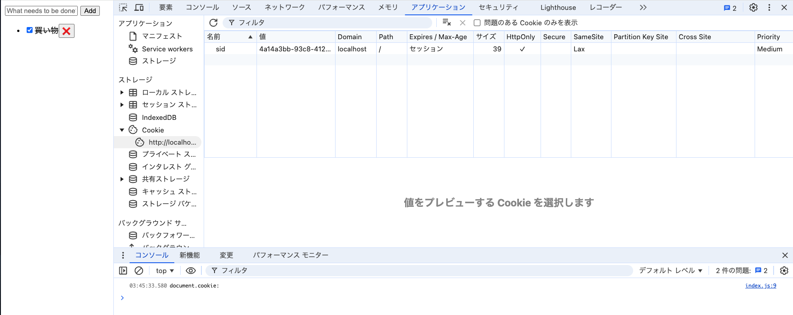
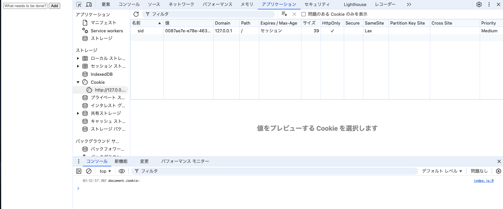

# 問題2
> このサーバでは Cookie を使ってクライアントのセッションを識別し、タスク一覧をセッションごとに分離して管理する簡易的な認証/認可を行っている。サーバが設定している Cookie の値は sid=<セッションに一意に割り当てた ID>; SameSite=Lax; Path=/; HttpOnly; である。ToDo アプリでいくつかのタスクを作成した後、以下に挙げる操作を実施したとき、それぞれどのような結果になるか記載し、その理由を説明しなさい。

## index.js でdocument.cookie プロパティを console.logで表示する
### 結果
* DOMContentLoadedで実行したが、何も出力されない。
### 理由
* HTTPOnly 属性が付いたクッキーは、JavaScript からアクセスできないから。
  * 参考：[HTTP Cookie の使用 - HTTP | MDN](https://developer.mozilla.org/ja/docs/Web/HTTP/Cookies#cookie_%E3%81%B8%E3%81%AE%E3%82%A2%E3%82%AF%E3%82%BB%E3%82%B9%E3%82%92%E3%83%96%E3%83%AD%E3%83%83%E3%82%AF)
  * HttpOnly 属性を持つ Cookie は、 JavaScript の Document.cookie API にはアクセスできません。サーバーに送信されるだけです。例えば、サーバー側のセッションを持続させる Cookie は JavaScript が利用する必要はないので、HttpOnly 属性をつけるべきです。この予防策は、クロスサイトスクリプティング（XSS）攻撃を緩和するのに役立ちます。

## ブラウザの開発者コンソールで http://localhost:3000/ の Cookie を表示する
* 

## ToDo アプリのタブをリロードする
* リロード前と同じ状態が表示された。

## 同一ブラウザの異なるタブやウィンドウで http://localhost:3000/ を開いて ToDo リストの状態を確認する
* 同じ状態が表示された。

## シークレットウィンドウや異なるブラウザで http://localhost:3000/ を開いて ToDo リストの状態を確認する
* 初期状態が表示された。(タスクが1つもない状態)

## http://127.0.0.1:3000/ を開いて ToDo リストの状態を確認する
* 初期状態が表示された。(タスクが1つもない状態)。
* 開発者ツールでCookieを確認したところ、http://localhost:3000/とは異なるセッションが発行されていた。
* 