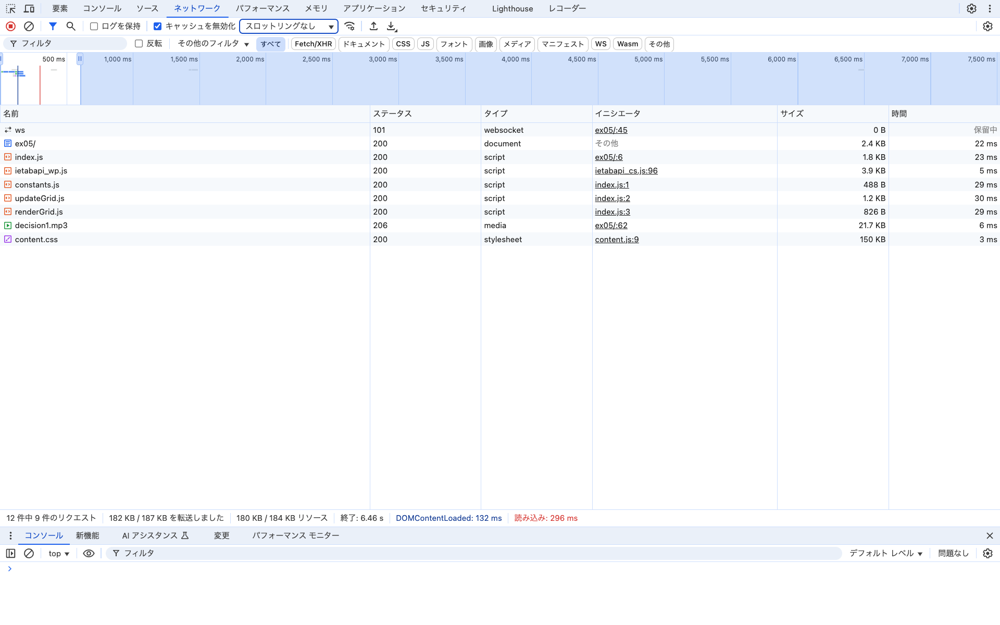

# Webpack実行ログ
```
sentomoMBP:ex05 sentomo$ npx webpack --mode=production ./index.js -o ./dist
asset main.js 1.13 KiB [compared for emit] [minimized] (name: main)
orphan modules 1.25 KiB [orphan] 3 modules
./index.js + 3 modules 2.59 KiB [built] [code generated]
webpack 5.97.1 compiled successfully in 873 ms
```

# バンドルしたコードと元のコードを比較し、どのような処理が行われたかを確認しなさい。
* 不要なimport/export文が削除された。文字数が3139文字から1160文字に減った。

# バンドル前後それぞれのコードを利用するページをローカルサーバで配信してブラウザから閲覧できるようにしなさい。開発者ツールで ネットワーク タブを開き、スクリプトのダウンロード時間、ページの読み込み完了時間について比較しなさい。
* バンドル前
  * スクリプトのダウンロード合計時間: 147ms
  * ページの読み込み完了時間: 296ms
  
* バンドル後
  * スクリプトのダウンロード合計時間: 46ms
  * ページの読み込み完了時間: 240ms
  

