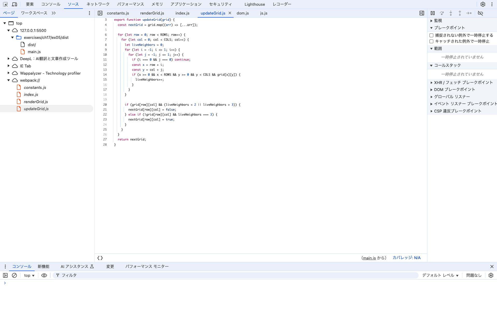
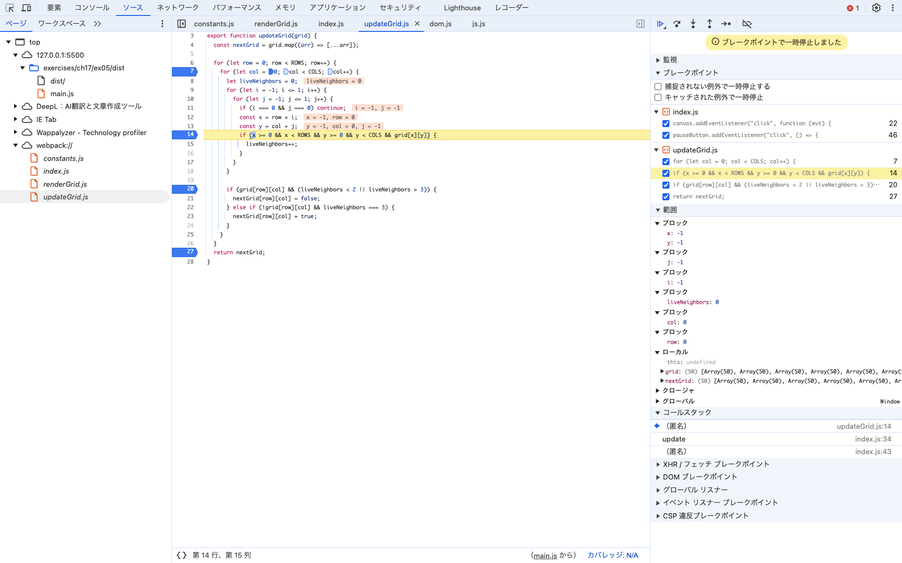

# Webpack実行ログ
```
sentomoMBP:ex05 sentomo$ npx webpack --mode=production --devtool=source-map ./index.js -o ./dist
asset main.js 1.17 KiB [emitted] [minimized] (name: main) 1 related asset
orphan modules 1.25 KiB [orphan] 3 modules
./index.js + 3 modules 2.59 KiB [built] [code generated]
webpack 5.97.1 compiled successfully in 780 ms
```
* ソースマップは、 `exercises/ch17/ex05/dist/main.js.map`を参照。

# 開発者ツールで ソース タブ(Chrome, Edge, Safari) または デバッガー タブ(Firefox) を開き、ソースコードファイルがどのように表示されるかを確認しなさい。
* `top` 以下に `webpack://` ディレクトリが表示され、その下にバンドル前のファイルが表示される。


# バンドルしたコードの実行中に、バンドル前のソースコードファイルに基づいたブレークポイントの設定や変数の値の確認等のデバッグが可能か確認しなさい。
* ブレークポイントの設定、変数の値の確認もできる。
