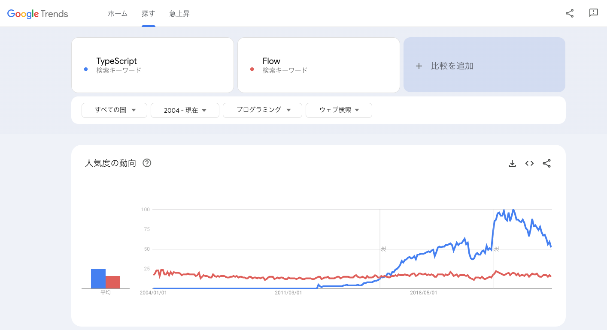

# TypeScriptとFlowについて、どちらが主流となっているかを調べなさい。 また、その理由を考えてまとめなさい。
## どちらが主流か？
* TypeScript

## Googleトレンド
* 2016年ごろから人気度はTypeScriptの方がFlowを上回り、上昇している。
* TypeScriptは、ReactやAngularなどの主要なフレームワークやライブラリで採用されており、業界全体での普及が進んでいると考えられる。

## 対応ツール
* TypeScript: Microsoftが開発しているというのもあり、VS Codeの拡張機能が充実している。
  * [TypeScript VSCode おすすめ拡張＆設定〜もうこれなしには生きられない〜 \#拡張機能 \- Qiita](https://qiita.com/togswr/items/04f5ae11a3fd78b7861d)
* Flow: VS Codeの拡張機能はあるが、GitHubリポジトリは、2024/12/19にアーカイブされている。
  * https://github.com/flow/flow-for-vscode

## コミュニティサポート
* TypeScript: Microsoftによって開発・維持されており、広範なコミュニティサポートと豊富なリソースが存在している。

* Flow: 技術記事が2014年〜2020年ごろの記事が多く、古い印象を受けた。

## 参考
* [Do people still use Flow? : r/reactjs](https://www.reddit.com/r/reactjs/comments/8zvjz1/do_people_still_use_flow/)

